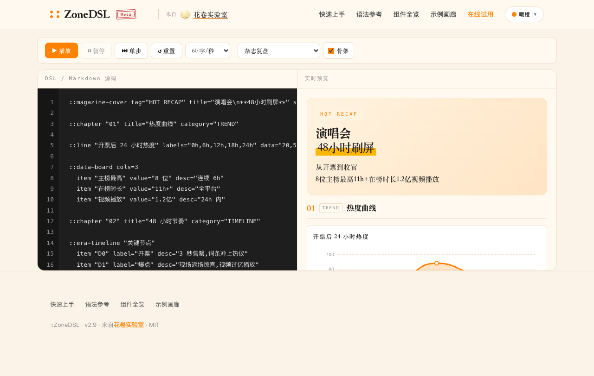

<div align="center">

# ::ZoneDSL

**The streaming-first A2UI protocol for conversational AI.**
<sub>A2UI = AI-to-UI：AI 产出结构化文本，前端渲染成 UI。</sub>

让 AI 的流式回复从「一堵 markdown 墙」变成「会排版、有图表、能交互的杂志页面」。

[](https://zonedsl.huajuan-labs.com)
[](./LICENSE)
[](./protocol/spec.md)
[](./CONTRIBUTING.md)

**👉 [在线 Playground](https://zonedsl.huajuan-labs.com)** · **📖 [Spec](./protocol/spec.md)** · **🤖 [AI Skill](./packages/skill/SKILL.md)** · **🌐 [English](./README.en.md)**



</div>

---

## 📋 目录

- [为什么需要 ZoneDSL](#为什么需要-zonedsl)
- [和 json-render 有什么不同](#和-json-render-有什么不同)
- [30 秒体验](#30-秒体验)
- [核心特性](#核心特性)
- [Packages](#packages)
- [协议与架构](#协议与架构)
- [任意定制扩展](#任意定制扩展)
- [让 AI 学会 ZoneDSL](#让-ai-学会-zonedsl)
- [FAQ](#faq)
- [贡献](#贡献)

## 为什么需要 ZoneDSL

大模型流式输出越来越长，但前端只能渲染成**一坨滚不完的 markdown**。四条行业痛点：

- 🔸 **纯 markdown 无版式**：没图表、没交互、没杂志感，长回复阅读体验差
- 🔸 **JSON 类 A2UI（如 json-render）无法与 markdown 散文混排**，且多为 web 框架（少小程序）
- 🔸 **缺 AI 输出规范**：模型不知道何时该出结构化组件、怎么写
- 🔸 **多端不统一**：Web / 小程序 / RN 各搞一套，无协议标准

ZoneDSL 一次性解决：**流式安全 parser** + **AI skill 规范** + **多端统一协议** + **70+ 预制组件**。

## 和 json-render 有什么不同

[json-render](https://json-render.dev)（Vercel，16k star）是主流 JSON 类 A2UI 框架。两者都流式、都预制组件，差异在范式：

| | ZoneDSL | json-render |
|---|---|---|
| 流式渲染 | ✅ parser `streamingSafe` | ✅ partial-JSON 流式 |
| 与 markdown 散文共存 | ✅ 文本交织，prose 里穿插 `::` | ❌ JSON 无法混入散文 |
| AI 生成范式 | text-first，LLM 原生吐 DSL | JSON-first，schema 约束 |
| 形态 | 协议 + 多端参考实现 | Web 框架（+ RN） |
| 小程序运行时 | ✅ `@zonedsl/wechat` | ❌ web + RN，无小程序 |
| AI 输出规范 | ✅ `@zonedsl/skill` 可移植 | ⚠️ 自带组件库 prompt |

> ZoneDSL 占**长文杂志内容**（复盘/解读/报告，prose + 组件交织），json-render 占**仪表盘/widget 生成**。不同市场，不打正面。

## 30 秒体验

**最快：直接打开 [在线 Playground](https://zonedsl.huajuan-labs.com)** —— 12 主题实时切、流式播放、70+ 组件全览，零安装。

**集成到项目**（npm 包发布前，从 git 装；发布后 `npm i @zonedsl/core @zonedsl/web`）：

```bash
npm install github:huajuan-labs/zonedsl#main
# 或 clone 后用 docs/assets/parser.umd.js + web-renderer.js
```

最小 Web 用法：

```html
<script src="docs/assets/parser.umd.js"></script>
<script src="docs/assets/web-renderer.js"></script>
<div id="out"></div>
<script>
  ZonePlayground.mount(document.getElementById('out'), '::callout "Hello **ZoneDSL**"');
</script>
```

流式渲染传 `{ streaming: true }`，骨架传 `{ skeleton: true }`，注册自定义组件用 `ZonePlayground.register('my-comp', fn)`。

## 核心特性

- **🌊 流式安全是 parser 语义** —— `streamingSafe` 丢半截属性、`dropPartialLastLine` 缓冲未换行尾行、`looksPartial` 识别半截符号。吐字过程零闪烁。
- **🤖 AI 是一等作者** —— `@zonedsl/skill` 教 AI *何时*输出 ZoneDSL、*怎么*写每个组件。协议的"生成方向"，markdown 库没有。
- **🔌 协议优先，非框架绑定** —— 一份 spec，web ✅ / WeChat ✅ / RN / Flutter 规划中。第三方跑通 conformance 套件即 "Compliant"。
- **🎨 70+ 组件 · 12 主题** —— primitive / structure / interactive / chart / preset 五层；editorial / literary / data / serene / luxe / purple / sky / sage / note / pop / serious / warm。
- **📦 零魔法** —— parser 纯 JS 无依赖，三态分发（CJS/ESM/UMD）。

## Packages

| 包 | 作用 | 状态 | 适用场景 |
|---|---|---|---|
| [`@zonedsl/core`](./packages/core) | Parser + AST（纯 JS，零依赖） | ✅ v1 | 所有渲染端底层 |
| [`@zonedsl/web`](./packages/web) | DOM 渲染器 + 图表 recipes + 主题 | ✅ v1 | 网页 AI 对话、Playground |
| [`@zonedsl/wechat`](./packages/wechat) | 微信小程序运行时（zone-node + towxml + 12 主题，生产验证） | ✅ v1 | 小程序 AI 客服 |
| [`@zonedsl/skill`](./packages/skill) | AI 输出规范 + 模板 + 组件目录 | ✅ v1 | Claude / Cursor / 各类 Agent |

> ZoneDSL 是市面**唯一带微信小程序渲染层的 A2UI 协议**——web 和小程序都生产可用，不是 demo。

## 协议与架构

ZoneDSL 是**协议优先**：spec 是源头，渲染器是实现。`@zonedsl/core` 是规范解析器，`@zonedsl/web` 和 `@zonedsl/wechat` 都是符合 spec 的参考实现。

```
AI Agent（载 @zonedsl/skill）
      ↓  ::component DSL 文本（流式）
@zonedsl/core  parser（streamingSafe → AST）
      ├─ @zonedsl/web      → DOM
      ├─ @zonedsl/wechat   → zone-node（小程序）
      └─ 第三方渲染器      → RN / Flutter（规划中）
```

真相在 [`protocol/spec.md`](./protocol/spec.md)——语法、流式语义、组件契约、扩展性。未来任何第三方都能写渲染器，跑通 conformance 套件即获 "ZoneDSL Compliant" 徽章。

## 任意定制扩展

parser **组件无关**——`::任何名字` 都能解析成 AST，组件是否存在是渲染层的事。所以：

- **加组件**：渲染器 `register('my-comp', fn)`，`::my-comp` 立刻可用，parser 零改动
- **加 intent**：宿主 `handleZoneAction` 加 `case`，button 透传 intent/value
- **加主题**：override `--mz-*` 变量或新增 theme 文件
- **禁用/替换**：不注册即丢弃（`UNKNOWN_MODE=silent`），同名重写即覆盖

协议层只管通用可移植集，平台专属的一切由宿主自管。详见 [spec §10](./protocol/spec.md)。

## 让 AI 学会 ZoneDSL

下载 skill 压缩包，解压到 agent 的 skills 目录：

```bash
# Claude Code
curl -L https://zonedsl.huajuan-labs.com/assets/zonedsl-skill.zip -o /tmp/zonedsl.zip
unzip /tmp/zonedsl.zip -d ~/.claude/skills/
```

AI 就知道：什么时候用 ZoneDSL（多小节 + 结构化）、什么时候退回纯 markdown（单句问答）、每个组件怎么写。

> 开发者（接入/扩展/跨平台）用 [dev skill](https://zonedsl.huajuan-labs.com/assets/zonedsl-dev-skill.zip)。
> 已 clone 仓库也可 `cp packages/skill/SKILL.md packages/skill/CATALOG-*.md ~/.claude/skills/zonedsl/`。

## FAQ

**ZoneDSL 可以商用吗？**
可以。MIT 协议，无附加限制。

**怎么在 Claude Code 本地接入？**
见上方「让 AI 学会 ZoneDSL」——把 skill 文件复制到 `~/.claude/skills/zonedsl/`，重启会话即可。

**流式半截内容渲染错乱/闪烁怎么办？**
开 parser 的 `streamingSafe` + `dropPartialLastLine`（流式态自动启用），渲染层用骨架态。原理见 [spec §4 流式语义](./protocol/spec.md)。

**如何自定义注册新组件？**
`ZonePlayground.register('my-comp', fn)`（web）或在 `toWxNodes.js` 加 case（wechat），parser 不用改。见 [spec §10](./protocol/spec.md)。

**npm 包什么时候发？**
按需发布。当前从 git 安装或用在线 Playground。有 `npm install` 需求时发。

## 贡献

详见 [`CONTRIBUTING.md`](./CONTRIBUTING.md)。parser 组件无关，**加组件无需改 parser**——在所用运行时注册即可。欢迎的方向：

- 补 React / Vue / RN / Flutter 渲染器（conformance → "Compliant"）
- 贡献领域模板（金融 / 医疗 / 教育）
- 补组件、主题、文档、示例
- issue / PR / ⭐ star 都欢迎

## 📄 License

MIT © [huajuan-labs](https://github.com/huajuan-labs)

---

<div align="center">

**如果 ZoneDSL 帮你解决了 AI 对话纯 markdown 渲染的痛点，点亮 ⭐ Star，让更多 AI Agent 开发者看到。**

Made with care by [huajuan-labs](https://github.com/huajuan-labs) · 为对话式 AI 的美感而生

</div>
